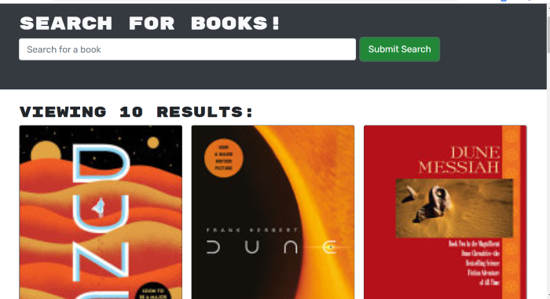

# Book-Search-Engine
This application allows the user to seach for books and while logged in the user is able to save books of thier choosing. The user aslo while logged in is able to delete books from thier saved book.

## Built With:
React
MongoDb
NodeJS
JSX
graphql
appollo 

In this project I built the typeDefs and Resolvers and made sure they correlate with the models and then my mutations and queries on the front end.  Most of this assignment was just building out the routing using graphql and apollo client. 

[Book-Search-Engine](https://desolate-reef-66969.herokuapp.com/)

